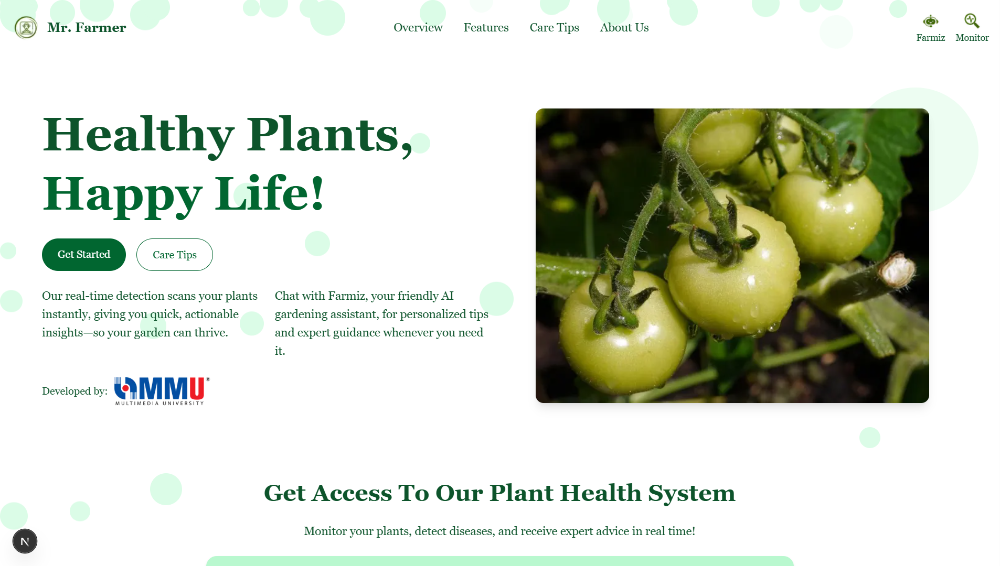

# 🌿 Plant Health Monitoring System (FYP)

This project presents an AI-powered plant health monitoring system that combines real-time computer vision, disease classification, and generative AI for treatment advice. It supports two modes: live webcam monitoring and an interactive chatbot called **Farmiz**.

## 🔍 System Overview

- **Detection:** YOLOv9s (mAP@50 = 0.994)
- **Tracking:** DeepSORT
- **Classification:** ResNet50 (99.53% accuracy)
- **Real Time Treatment Pipeline:** LangChain + CSV Agent + Llama 3.2 3b
- **Backend:** FastAPI
- **Frontend:** Next.js
- **Chatbot:** Gemma3 4b via Ollama

 

---

## 📦 Features

### 🌿 Real-Time Monitoring
- Detects plant leaves using YOLOv9s
- Tracks individual leaf using DeepSORT
- Classifies 16 disease categories via ResNet50
- Saves results to CSV
- RAG pipeline generates treatment prescription via LangChain + Llama 3.2b

### 🤖 Farmiz Chatbot
- Upload an image or ask a plant-related question
- Detects and classifies plant health
- Generates natural language response powered by Gemma3
- Works with or without CSV-based RAG

---

## 🧪 Tech Stack

- Python, JavaScript,
- FastAPI, Next.js, PyTorch, OpenCV
- LangChain, Ollama (Gemma & Llama models)
- Git, Anaconda, Figma

---

## 📈 Performance

| Model     | Accuracy | Notes                              |
|-----------|----------|------------------------------------|
| ResNet50  | 99.53%   | Final classifier for disease types |
| YOLOv9s   | mAP@50: 0.994 | 6 leaf types, 5440 images     |

---

## 🎬 Project Demo

[📺 Watch the Demo Video](https://youtu.be/oxByOFggy5E?si=p3GfxdC4rsC-21Ck)

---

## 📫 Contact

**Marcus Gan**  
📍 Malaysia  
📧 gan.marcustw@outlook.com  
🔗 [LinkedIn](https://www.linkedin.com/in/ganmarcustw13)  
🔗 [GitHub](https://github.com/MarcusWey)

