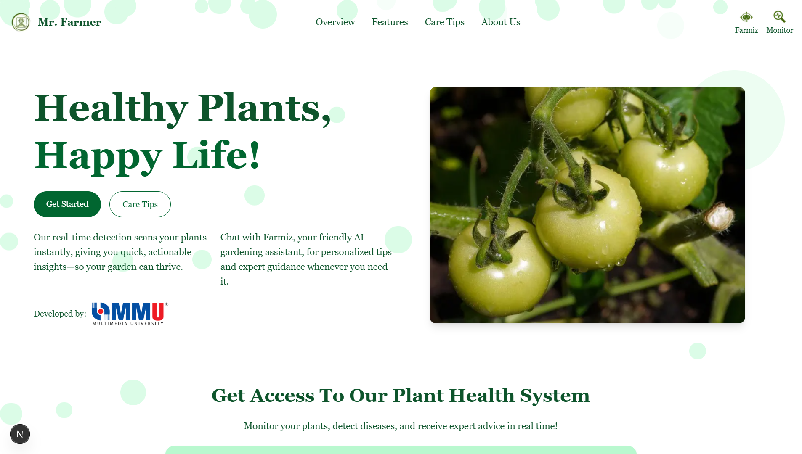

# 🌿 Plant Health Monitoring System (FYP)

This project presents an AI-powered plant health monitoring system that combines real-time computer vision, disease classification, and generative AI for treatment advice. It supports two modes: live webcam monitoring and an interactive chatbot called **Farmiz**.

## 🔍 System Overview

- **Detection:** YOLOv9s (mAP@50 = 0.994)
- **Tracking:** DeepSORT
- **Classification:** ResNet50 (99.53% accuracy)
- **Real Time Treatment Pipeline:** LangChain + CSV Agent + Llama 3.2 3b
- **Backend:** FastAPI
- **Frontend:** Next.js
- **Chatbot:** Gemma3 4b via Ollama

 

---

## 📦 Features

### 🌿 Real-Time Monitoring
- Detects plant leaves using YOLOv9s
- Tracks individual leaf using DeepSORT
- Classifies 16 disease categories via ResNet50
- Saves results to CSV
- RAG pipeline generates treatment prescription via LangChain + Llama 3.2b

### 🤖 Farmiz Chatbot
- Upload an image or ask a plant-related question
- Detects and classifies plant health
- Generates natural language response powered by Gemma3
- Works with or without CSV-based RAG

---

## 🗂 Project Structure
plant-health-monitoring-fyp/
├── demo/ # Screenshots or video previews
├── notebooks/ # Model training notebooks
├── src/
│ ├── app/
│ │ ├── backend/ # FastAPI backend
│ │ └── frontend/ # Next.js frontend
│ ├── detection/ # YOLOv9s prediction
│ ├── classification/ # ResNet50 classifier
│ ├── tracking/ # DeepSORT tracker
│ └── chatbot/ # LangChain CSV agent & Gemma chatbot
├── requirements.txt
├── .gitignore
└── README.md

---

## 🧪 Tech Stack

- Python, JavaScript,
- FastAPI, Next.js, PyTorch, OpenCV
- LangChain, Ollama (Gemma & Llama models)
- Git, Anaconda, Figma

---

## 📈 Performance

| Model     | Accuracy | Notes                              |
|-----------|----------|------------------------------------|
| ResNet50  | 99.53%   | Final classifier for disease types |
| YOLOv9s   | mAP@50: 0.994 | 6 leaf types, 5440 images     |

---

## 🎬 Project Demo

[📺 Watch the Demo Video](https://youtu.be/oxByOFggy5E?si=p3GfxdC4rsC-21Ck)

---

## 📫 Contact

**Marcus Gan**  
📍 Malaysia  
📧 gan.marcustw@outlook.com  
🔗 [LinkedIn](https://www.linkedin.com/in/ganmarcustw13)  
🔗 [GitHub](https://github.com/MarcusWey)

## 🚀 How to Run the System

> Follow these steps to run the full-stack system locally.

### 🧰 1. Environment Setup

#### a. Clone the Repository

```bash
git clone https://github.com/your-username/real-time-plant-health-monitoring-fyp.git
cd real-time-plant-health-monitoring-fyp
```

#### b. Create and Activate Virtual Environment (Recommended)

```bash
conda create -n plant-monitor python=3.10
conda activate plant-monitor
```

#### c. Install Python Dependencies

```bash
cd src/backend
pip install -r requirements.txt
```

> Make sure `requirements.txt` includes:

```txt
fastapi
uvicorn
torch
torchvision
opencv-python
pandas
pillow
ultralytics
langchain
ollama
deep_sort_realtime
```

#### d. Install Ollama and Required Models

Ollama is required to serve local language models used by the chatbot and treatment generator.

Visit the [Ollama installation guide](https://ollama.com/download) and follow instructions for your OS.

Once installed, run the following commands in your terminal to download the required models:

```bashbash
ollama pull gemma3:latest
ollama pull llama3.2:3b
```

These models power Farmiz chatbot and real-time prescription generation.

---

### 🧠 2. Run Backend (FastAPI)

> Open **Terminal 1** and run:

```bash
cd real-time-plant-health-monitoring-fyp/src/backend
uvicorn main:app --host 0.0.0.0 --port 8000 --reload
```

* Starts API at: `http://127.0.0.1:8000`
* Key routes:

  * `/realtime/start-webcam`
  * `/realtime/start-session`
  * `/chatbot/begin-session`
  * `/chatbot/upload-image`
  * `/chatbot/ask`

---

### 🌐 3. Run Frontend (Next.js)

> Open **Terminal 2** and run:

```bash
cd real-time-plant-health-monitoring-fyp/src/frontend
npm install
npm run dev
```

* Open `http://localhost:3000`
* Navigate to:

  * **Real-Time Monitoring** `/realtime-monitoring`
  * **Farmiz Chatbot** `/farmiz-chatbot`

#### Additional Notes for Frontend Setup

* Ensure Node.js (>=18.x) and npm are installed.
* Project uses Next.js, TailwindCSS, and React.
* Static assets (e.g. logos, icons, tips) should be placed in `public/` folder.
* To edit the homepage and routes, check `pages/index.js`, `pages/farmiz-chatbot.js`, and `pages/realtime-monitoring.js`.

---

### 📷 4. Webcam Configuration

Ensure your mobile IP webcam is streaming at:

```bash
http://192.168.68.101:8080/video
```

If different, update the URL in `realtime_monitoring.py` accordingly.

---

### 💡 5. Using the System

#### 🌿 Real-Time Monitoring

* Start Webcam → Begin Session
* Detects leaves → Tracks → Classifies → Saves to CSV
* Generates prescriptions via CSV Agent + Llama 3.2b

#### 🤖 Chatbot (Farmiz)

* Start Session → Ask a question or upload a plant image
* Classifies disease → Responds using Gemma3
* Works even without detection session


